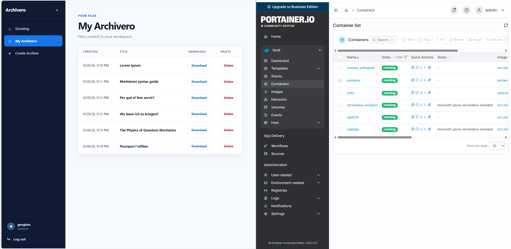

# Introduction

I wanted a bigger demo with complex situations so I could experiment and test a wider set of skills, I had in mind past interviews, where I was invited by companies that had different types of async file handlings, inspired on that I decided to create this demo and keep playing with it and expanding it.

## Skills

c#, minimal api, service bus, blob storage, docker containers, AI agent, Redis, EF, SqlServer.

## Getting Started

What you need to run the project on windows:

1. Install .Net 10 with SDK and EF
2. Clone project with Git
3. Activate WSL in windows and install docker
4. Set configuration, check section below.

To open diagrams you can install draw.io or open them directly in the website editor.

## General Configuration

I use my local user secrets to share configuration and never place secrets inside the repository, you can use it as well. For more information on how to: https://learn.microsoft.com/en-us/aspnet/core/security/app-secrets?view=aspnetcore-10.0&tabs=windows

Else you can place the configuration settings on the 2 projects that consume them: the backend and worker.

The required settings are:

```
{
    "ConnectionStrings": {
		"ArchiveroDB": "<sqlserver connecction string>",
    },
	"ArchiveroJwt": {
		"Issuer": "Archivero.Api",
		"Audience": "Archivero.Client",
		"SigningKey": "<your long encryption seed (mininum 47 char long)>",
		"ExpirationMinutes": 480
    },
	"ArchiveroAuth": {
    	"AdminUsername": "",
		"AdminPassword": "<12 chars strong password>",
    },
	"ArchiveroBlobService": {
		"ContainerName": "archivero",
		"ConnectionString": "<Azure blob storage>",
    },
	"ArchiveroFileBus": {
		"CreateWordFileQueueName": "createwordfilequeue",
		"DeleteWordFileQueueName": "deletewordfilequeue",
		"ConnectionString": "<Azure service bus connection string>",
    },
}
```

## Backend Configuration

For the moment, I have Redis only inside the backend project, it has no security, so the settings below is everythign you need.
Also the backend is the main owner of the database, so it will construct the schema when executed.

```
{
  "Redis": {
    "Password": "",
    "AllowAdmin": true,
    "Ssl": false,
    "ConnectTimeout": 5000,
    "SyncTimeout": 5000,
    "Database": 0,
    "Hosts": [
      {
        "Host": "localhost",
        "Port": 6379
      }
    ],
    "PoolSize": 5,
    "IsDefault": true
  },
  "Database": {
    "EnsureCreatedOnStartup": true
  },
}
```

## Test

The App and Services can run in Azure, locally in windows or in WSL by using docker containers.



Restore packages and compile (with dotnet commands or VS)

## Docker

Build and run all applications and infrastructure from a fresh Linux/WSL Docker installation:

```bash
cd docker
cp .env.example .env
# Fill in the blank passwords and keys in .env.
bash run-archivero.sh
```

The script runs `docker compose -f docker-compose.yml up --build`.
Use `sudo bash run-archivero.sh` if your account needs sudo to access Docker.
See [docker/README.md](docker/README.md) for configuration, ports and shutdown commands.
